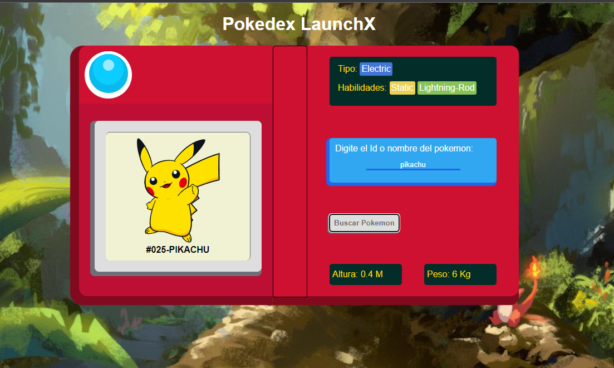
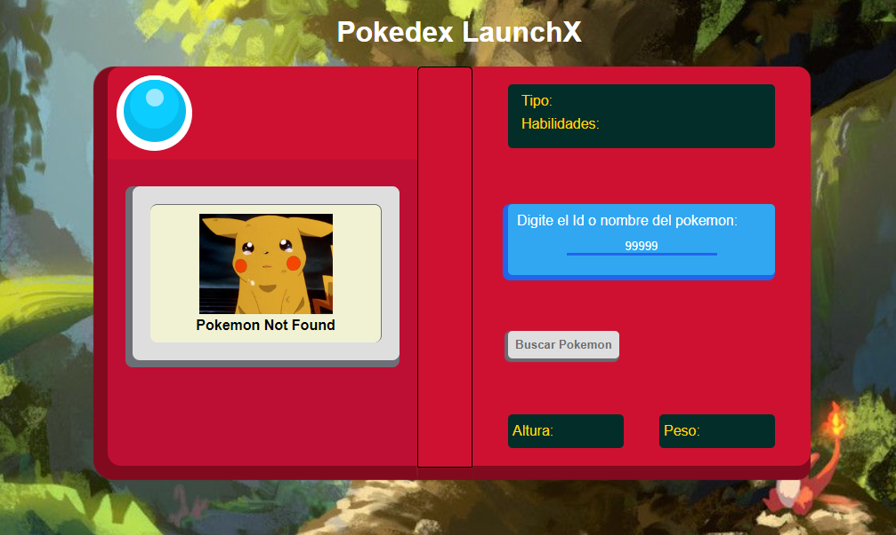

# Pokedex

La funcionalida de la página es el consumo de un Restful API
[PokeAPI](https://pokeapi.co), mostrando los datos recibidos del pokemon deseado.

## Preview de la página web:

Para buscar al pokemon, se tiene que digitar el nombre o el Id del pokemon deseado. Si el pokemon no es encontrado se mostrará un mensoje de **Not found**.

## Tecnologias Empleadas:
    - Html
    - Css
    - JavaScript